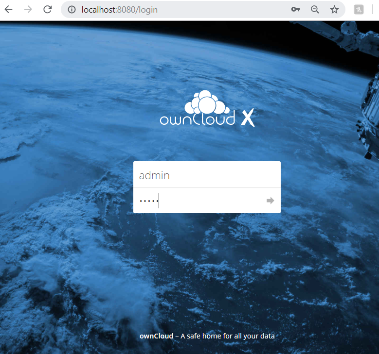

Before installing an ownCloud Server, you should first consider the deployment
[considerations](https://doc.owncloud.com/server/admin_manual/installation/deployment_considerations.html)
and
[recommendations](https://doc.owncloud.com/server/admin_manual/installation/deployment_recommendations.html).
These include decisions like

- Hardware
- Operating System
- Database
- Storage
- Number of Users
- etc.

Take a look at the
[System Requirements](https://doc.owncloud.com/server/admin_manual/installation/system_requirements.html)
page to ensure you choose the officially supported environments.

Once your environment is ready, you can begin installing the ownCloud Server.
You'll do that next.

## Installation

There are two ways to install your server:

- [Docker](#installing-with-docker)
- [Tar/Zip Archive File](#installing-with-a-tarzip-file)

You'll see how to install ownCloud with Docker first.

### Installing with Docker

> **Note:** You must have Docker installed on your machine before installing
> the ownCloud Server using Docker. See Docker's
> [Installation](https://docs.docker.com/v17.09/engine/installation/)
> documentation for more information.

To install an ownCloud Server on your local machine using Docker, follow the
steps below:

1.  Create a new folder for your ownCloud server to reside. This article will
    refer to your new server folder as *Server Home*.

2.  In your Server Home folder, create a `docker-compose.yml` and add the
    following
    [content](https://raw.githubusercontent.com/owncloud/docs/master/modules/admin_manual/examples/installation/docker/docker-compose.yml)
    to it.

3.  Create a `.env` file in your Server Home folder with the following
    declarations:

    ```
    OWNCLOUD_VERSION=10.2
    OWNCLOUD_DOMAIN=localhost
    ADMIN_USERNAME=admin
    ADMIN_PASSWORD=admin
    HTTP_PORT=8080
    ```

4.  Build and start your Docker container:

    ```shell
    docker-compose up -d
    ```

Awesome! Your ownCloud Server is running locally on your machine! You can open
http://localhost:8080 to view the ownCloud login page.



The default username and password are `admin` and `admin`, respectively. You can
change these any time from your `.env` file. You can further consult Docker's
[documentation](https://docs.docker.com/) for more information on configuring
your Docker container.

Next, you'll step through the steps for installing ownCloud with a Tar/Zip file.

### Installing with a Tar/Zip File

To install ownCloud to your local machine via Tar/Zip file, follow these steps:

1.  Install the required packages necessary to run the ownCloud Server. You can
    view the list of prerequisites
    [here](https://doc.owncloud.com/server/admin_manual/installation/manual_installation.html#install-the-required-packages).

2.  Navigate to the [ownCloud Downloads](https://owncloud.org/download/) page
    and download the Tar/Zip version you prefer.

3.  Extract the archive file contents. The unpacked archive file resides in a
    single `owncloud` directory.

4.  Copy the `ownCloud` to a running web server. For example, if you plan to run
    ownCloud on an Apache HTTP server, you can copy `ownCloud` to your Apache
    document root. For more information on configuring Apache, see the
    [Configuring Apache](https://doc.owncloud.com/server/admin_manual/installation/manual_installation.html#configure-apache)
    section. This article will assume the Apache server is used.

    For other HTTP servers, it's recommended to copy `ownCloud` outside the
    document root. 

5.  Restart your Apache server.

6.  Run ownCloud's Installation Wizard by navigating to
    http://localhost/owncloud.

7.  Insert your desired account username and password. Then click *Finish
    Setup*.

You can now begin using your new ownCloud Server!

Next, you'll configure your ownCloud Server.

## Configuration

Once you've installed your ownCloud Server, you're presented with a vanilla
version that can be easily customized. ownCloud provides a slew of configuration
options that let you administer your hosted files in many different ways. Some
configuration topics include

- [General](https://doc.owncloud.com/server/admin_manual/configuration/general_topics/)
- [Database](https://doc.owncloud.com/server/admin_manual/configuration/database/)
- [Encryption](https://doc.owncloud.com/server/admin_manual/configuration/files/encryption/root.html)
- [External Storage](https://doc.owncloud.com/server/admin_manual/configuration/files/external_storage/)
- [Files](https://doc.owncloud.com/server/admin_manual/configuration/files/)
- [LDAP](https://doc.owncloud.com/server/admin_manual/configuration/ldap/)
- [Mimetypes](https://doc.owncloud.com/server/admin_manual/configuration/mimetypes/)