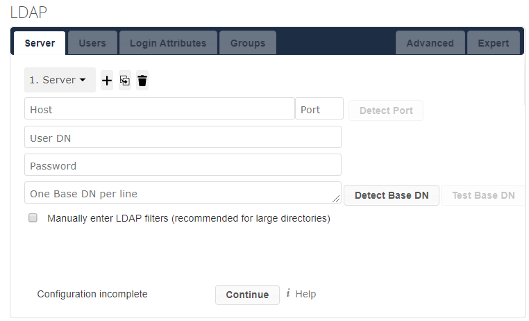

Once you've
[installed your ownCloud Server](./01-installing-an-owncloud-server.md), you can
share you data with other users by allowing them to connect to your server.
You'll do this by configuring ownCloud's built-in LDAP application. Once LDAP is
enabled in your ownCloud Server, users can access ownCloud by providing their
LDAP credentials. 

Configure LDAP in your ownCloud Server by following these instructions:

1.  In your server's UI, navigate to the top right dropdown menu and select
    *Settings*.

2.  Click *Apps* from the left menu.

3.  Click the *Show disabled apps* button.

4.  Select *Enable* for the LDAP Integration application.

5.  Click *User Authentication* from the left menu. You're now offered an LDAP
    configuration screen.

    

6.  Define the LDAP server's configuration by filling in the required fields.
    For example, you must configure your LDAP server's IP address and port. You
    can learn more about each field in ownCloud's
    [Server Tab](https://doc.owncloud.com/server/admin_manual/configuration/user/user_auth_ldap.html#server-tab)
    documentation.

7.  Open the [Users](https://doc.owncloud.com/server/admin_manual/configuration/user/user_auth_ldap.html#user-filter),
    [Login Attributes](https://doc.owncloud.com/server/admin_manual/configuration/user/user_auth_ldap.html#login-filter),
    and [Groups](https://doc.owncloud.com/server/admin_manual/configuration/user/user_auth_ldap.html#group-filter)
    tabs and configure them, if necessary. These are not required for your LDAP
    server configuration.

8.  Save your LDAP server's configurations.

You can now authenticate users when connecting to your ownCloud Server by using
LDAP!