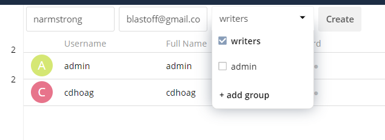

File hosting is only useful when you have consumers that can access your data.
Add users to your ownCloud Server so they can access your content.

1.  Navigate to the top right dropdown menu and select *Users*.

    

2.  Enter the username and email for the user you want to create.

3.  Assign the user to a group, if desired.

    

4.  Select the *Create* button.

> **Note:** Usernames may contain letters (a-z, A-Z), numbers (0-9), dashes
> (`-`), underscores (`_`), periods (`.`), and `@` signs.

Excellent! You've added a user to your ownCloud Server. For additional topics on
how to edit a user, see the following topics:

- [Password Reset](https://doc.owncloud.com/server/admin_manual/configuration/user/user_configuration.html#password-reset)
- [Renaming Users](https://doc.owncloud.com/server/admin_manual/configuration/user/user_configuration.html#renaming-a-user)
- [Deleting Users](https://doc.owncloud.com/server/admin_manual/configuration/user/user_configuration.html#deleting-users)
- [Granting Administrator Privileges](https://doc.owncloud.com/server/admin_manual/configuration/user/user_configuration.html#granting-administrator-privileges)
- [Managing Groups](https://doc.owncloud.com/server/admin_manual/configuration/user/user_configuration.html#managing-groups)
- [Enabling Custom Groups](https://doc.owncloud.com/server/admin_manual/configuration/user/user_configuration.html#enabling-custom-groups)
- [Setting Storage Quotas](https://doc.owncloud.com/server/admin_manual/configuration/user/user_configuration.html#setting-storage-quotas)