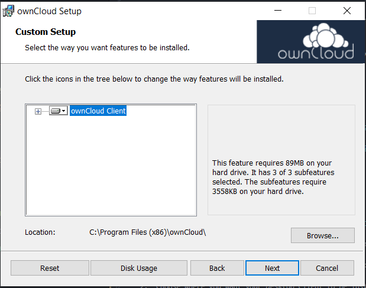
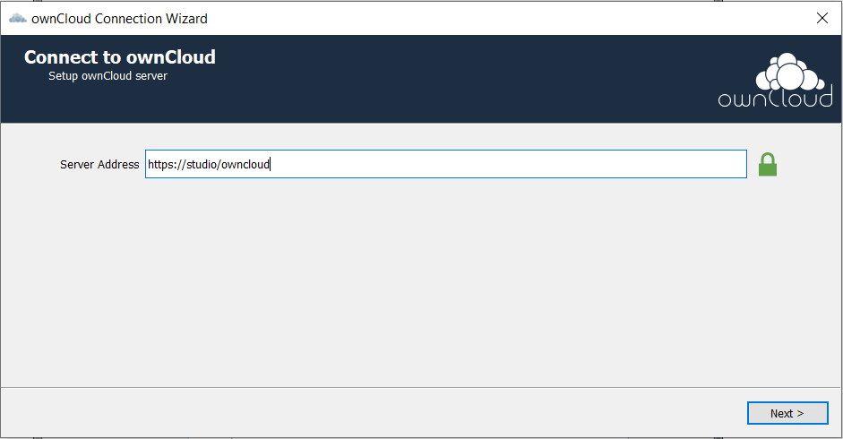

To connect to an existing ownCloud Server, you must download and install the
Desktop Synchronization Client.

There are Desktop Clients for the following operating systems:

- Linux
- macOS
- Windows

Navigate to the
[ownCloud Desktop Clients](https://owncloud.com/download/#desktop-clients) page
to install the client matching your OS. Review the
[system requirements](https://doc.owncloud.org/desktop/2.5/installing.html#system-requirements)
for each OS before continuing with your installation.

Mac OS X and Windows users can download the program and double-click it to
launch the installation wizard.

Linux users much follow the instructions found
[here](https://doc.owncloud.org/desktop/2.5/installing.html#installing-the-desktop-synchronization-client).

Once you've launched the installation wizard, follow the steps below:

1.  Click *Next* to continue through the introduction screen.

2.  Choose where you want your Desktop Client to be installed on your local
    machine.

    

3.  Click *Next* and then *Install*.

4.  Once the installation concludes, you're provided a connection wizard. Insert
    the ownCloud Server address to which you want to connect. Then click *Next*.

    

5.  Enter you ownCloud user credentials. Then click *Next*.

6.  Set up your local folder and sync options. You can choose to sync everything
    from the server or choose the items manually.

7.  Click *Connect* to connect your Desktop Client to the ownCloud Server.

Once your client is successfully connected, the files you selected will begin
downloading to the local folder you specified.